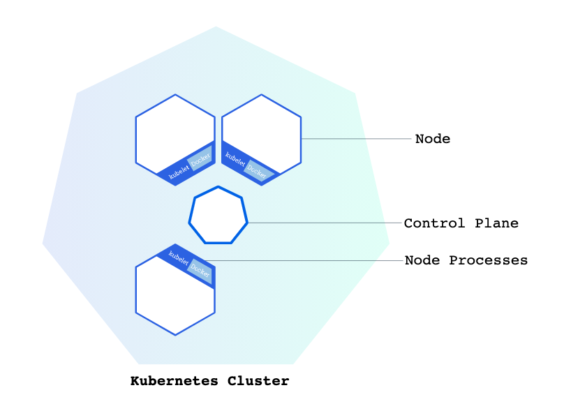

# Kube - Notes about Kubernetes

The abstractions in Kubernetes allow you to deploy containerized applications to a cluster without tying them specifically to individual machines.

A Kubernetes cluster consists of two types of resources:
- The Control Plane coordinates the cluster
- Nodes are the workers that run applications



**The Control Plane**

Responsible for managing the cluster. The Control Plane coordinates all activities in your cluster, such as scheduling applications, maintaining applications' desired state, scaling applications, and rolling out new updates.

**Node**

It is a VM or a physical computer that serves as a worker machine in a Kubernetes cluster.
Each node has a Kubelet, which is an agent for managing the node and communicating with the Kubernetes control plane. The node should also have tools for handling container operations, such as containerd or Docker. A Kubernetes cluster that handles production traffic should have a minimum of three nodes.

## Pod

A Pod is a Kubernetes abstraction that represents a group of one or more application containers, and some shared resources for those containers. Those resources include:
- Shared storage, as Volumes
- Networking, as a unique cluster IP address
- Information about how to run each container, such as the container image version or specific ports to use
- Every pod gets its own cluster wide ip address
- containers within a Pod can all reach each other's ports on localhost.

The containers in a Pod share an IP Address and port space, are always co-located and co-scheduled, and run in a shared context on the same Node.

Each Pod is tied to the Node where it is scheduled, and remains there until termination (according to restart policy) or deletion

```yaml
apiVersion: v1
kind: Pod
metadata:
  name: myapp
  labels:
    app.kubernetes.io/name: myapp
spec:
  containers:
  - name: myapp
    image: apmaros/myapp:latest
    ports:
    - containerPort: 5050
      name: http-web-svc
```

## Deployment

Deployment is used to described a desired state of the app. The state can be for example a desired number of app replicas running. A deployment controller then watches the cluster changes and attempts to maintain that state. For example if a pod is terminated, deployment schedules another pod.

A port definition in Pod can have a name. This name can be referenced in the `targetPort` attribute of a Service.

In this case the traffic is not routed to the app directly but we are using Envoy side car proxying the ingress traffic to the app. You can read more about the proxy in [Envoy](envoy.md).

```yaml
apiVersion: apps/v1
kind: Deployment
metadata:
  name: myapp
  labels:
    type: web-app
    app.kubernetes.io/name: myapp
spec:
  replicas: 1
  selector:
    matchLabels:
      app.kubernetes.io/name: myapp
  template:
    metadata:
      labels:
        app.kubernetes.io/name: myapp
    spec:
      containers:
      - name: myapp
        image: apmaros/myapp:latest
        ports:
          - containerPort: 5050
            name: http-web-svc
        volumeMounts:
          - name: envoy-config-volume
            mountPath: /etc/envoy-config/
      - name: envoy
        image: envoyproxy/envoy:v1.22-latest
        ports:
          - containerPort: 9901
            protocol: TCP
            name: envoy-admin
          - containerPort: 9900
            protocol: TCP
            name: envoy-web
        volumeMounts:
          - name: envoy-config-volume
            mountPath: /etc/envoy-config/
        livenessProbe:
          httpGet:
            path: /stats
            port: 9901
          failureThreshold: 3
          initialDelaySeconds: 10
          periodSeconds: 10
          successThreshold: 1
          timeoutSeconds: 5
        readinessProbe:
          httpGet:
            path: /ready
            port: 9901
          failureThreshold: 3
          initialDelaySeconds: 5
          periodSeconds: 10
          successThreshold: 1
          timeoutSeconds: 5
        command: ["/usr/local/bin/envoy"]
        args: ["-c", "/etc/envoy-config/enovy-config.yaml", "-l", "info","--service-cluster","servicea","--service-node","servicea", "--log-format", "[METADATA][%Y-%m-%d %T.%e][%t][%l][%n] %v"]
      volumes:
        - name: envoy-config-volume
          configMap:
            name: sidecar-config
            items:
              - key: envoy-config.yaml
                path: enovy-config.yaml

```

## Service

A service exposes a pod as a network service. The set of Pods targeted by a Service is usually determined by a selector. In this case we use selector `app.kubernetes.io/name: myapp`

```yaml
apiVersion: v1
kind: Service
metadata:
  name: myapp-svc
spec:
  selector:
    app.kubernetes.io/name: myapp
  ports:
    - name: http-web
      protocol: TCP
      port: 80
      targetPort: envoy-web
```

## Selectors
Labels are key/value pairs that are attached to objects, such as pods

## Liveness and Readiness Probes

**Readiness** - to know when the container is ready to start acceppting traffic, when fails application is removed from traffic

**Liveness** - application is in healthy state, when fails application is restarted

Example of a probe:

```yaml
readinessProbe:
  httpGet:
    path: /ready
    port: 9901
failureThreshold: 3
initialDelaySeconds: 5
periodSeconds: 10
successThreshold: 1
timeoutSeconds: 5
```

## Reference
- https://kubernetes.io/
- https://kubernetes.io/docs/concepts/overview/working-with-objects/labels/
